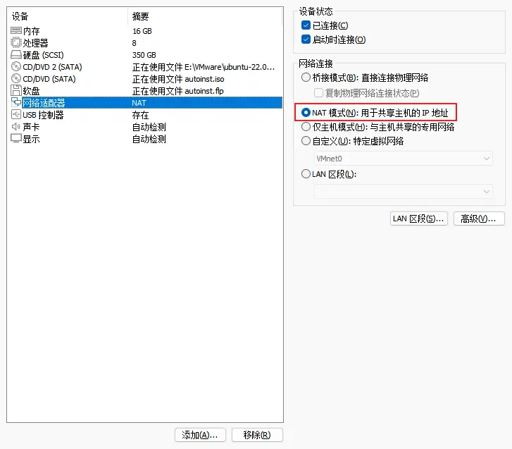
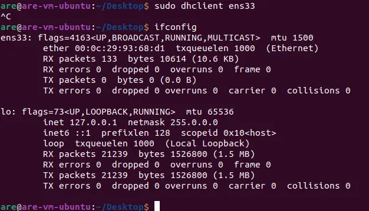
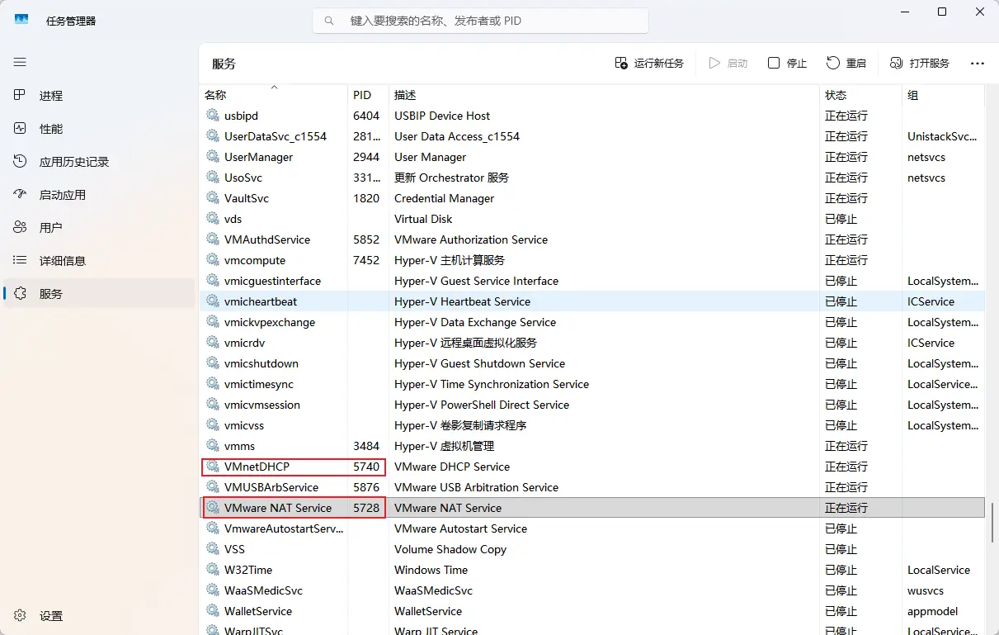
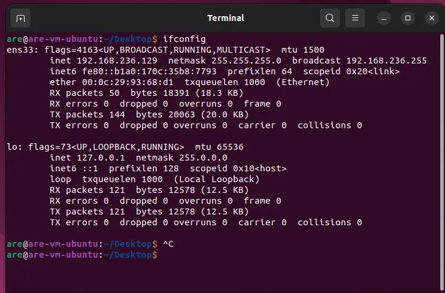

---
title:
description:
tags:
created: 2026-06-30
updated: 2026-06-30
number headings: first-level 1, start-at 1, max 3, 1.1, auto, contents toc, off
---

[Ubuntu虚拟机不显示ipv4地址 （虚拟机无法连接网络） - yangrourou - 博客园](https://www.cnblogs.com/yangrourou/p/17067007.html)

教程无效，我的两项Windows服务已经处于运行状态
重启也无效

重启Ubuntu后，可以看到 ipv4 网络

> 具体原因不详

