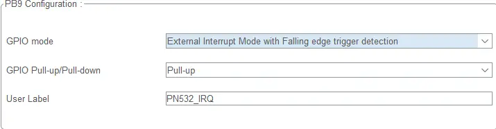
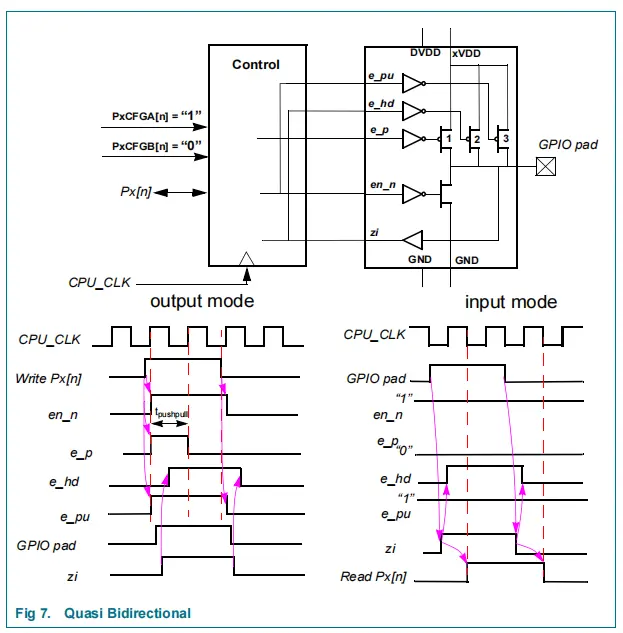
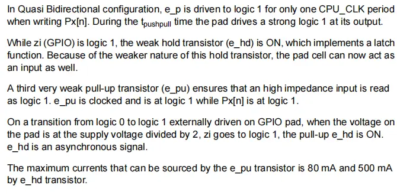

---
title:
description:
tags:
created: 2026-06-10
updated: 2026-06-10
number headings: first-level 1, start-at 1, max 3, 1.1, auto, contents toc
---
# 1 背景说明

### 1.1.1 P70_IRQ 默认为准双向模式，能否用于外部中断产生呢？

### 1.1.2 如果可以，STM32 的中断引脚如何配置？

   配置为外部中断模式，采用什么边沿触发？是否需要上拉？

# 2 准双向模式电路时序图

[[../../项目/PN532驱动库移植_基于SMT32L4/PN532模块基本介绍和接线说明|PN532模块基本介绍和接线说明]] 搞清P70_IRQ引脚的作用

这是 MCU/STM32 类芯片**准双向 GPIO 端口单元（Pad Cell）** 的内部模拟电路描述，端口引脚同时支持输出、输入，依靠 3 支不同强弱的 MOS 管实现锁存、强推挽输出、弱上拉浮空保护。

**涉及管子命名：**

- `e_p`：强推挽输出 PMOS（写 1 时驱动高电平）
- `e_hd`：弱保持锁存 PMOS（保持当前电平，实现锁存）
- `e_pu`：极弱浮空上拉 PMOS（引脚高阻时默认读 1）
  

**控制信号：**
- `zi`：引脚电平检测逻辑信号（引脚电压过半时置 1）
- `CPU_CLK`：内核系统时钟
- `Px[n]`：端口寄存器第 n 位输出锁存值

手册里面对该电路的描述如下：

逐段翻译说明：

准双向模式下：软件向端口寄存器`Px[n]`写入 1 时，**强推挽管 e_p 仅导通一个 CPU 时钟周期**；在`tpushpull`这段短暂推挽时间内，引脚输出强高电平。当引脚检测信号`zi`为高电平时，弱保持管`e_hd`持续导通，实现电平锁存功能。由于`e_hd`驱动能力远弱于`e_p`，外部电平可以轻松覆盖它的输出，因此该引脚同时具备输入功能。

>1. **e_p 只导通 1 个时钟**
>
>写 1 瞬间仅短暂打开强上拉管，提供大电流把引脚快速拉到 VDD；不是持续导通，仅做 “上电驱动脉冲”。
>
>`tpushpull`：强推挽窗口时间，就是那一个 CPU 时钟宽度。
>
>2. **e_hd 锁存机制**
>
>引脚电平被拉到高后，`zi=1`，`e_hd`永久打开，持续微弱维持高电平；
>
>**弱管是实现双向的核心**
>
>`e_hd`电流小、驱动弱：
>
>- 做输出：e_p 短时强拉电平，之后 e_hd 微弱维持；
>
>- 做输入：外部外设可以轻松拉低 / 拉高引脚，覆盖 e_hd 的微弱驱动，芯片就能正确读取外部电平。
>
>  
>
>  如果是持续强驱动管，外部信号拉不动引脚，就只能做纯输出。

第三支极弱上拉管`e_pu`作用：当引脚浮空（高阻、无外部驱动）时，芯片读入电平默认为逻辑 1。`e_pu`是时钟控制型管子，仅当端口寄存器输出位`Px[n]=1`时才导通。

若外部设备主动将引脚从低电平拉向高电平：当引脚电压达到电源电压的 1/2 阈值时，检测信号`zi`立刻跳为 1，随即打开保持管`e_hd`。`e_hd`的导通控制是**异步信号**，不受 CPU 时钟同步约束。

各管子最大拉电流（从 VDD 向引脚输出电流）：

- 极弱浮空上拉管 e_pu：最大输出 80mA
- 弱保持锁存管 e_hd：最大输出 500mA