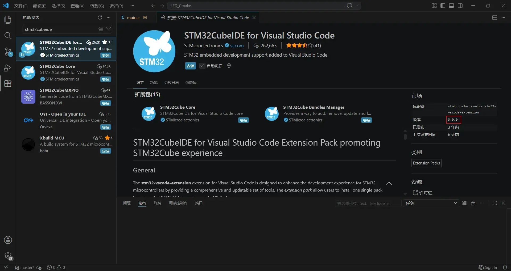

告别 Keil，用更现代更适合AI的工具链开发 STM32。参考 [Keysking 视频](https://www.bilibili.com/video/BV1QfbpzGENy/) 整理。

# 1 Keil vs VScode

| 对比   | Keil            | VSCode + CMake + GCC |
| ---- | --------------- | -------------------- |
| 成本   | 商业付费(不想听音乐了)    | 免费开源                 |
| 编辑体验 | 一般              | 智能补全、多插件             |
| 项目管理 | .uvprojx 绑定 IDE | CMakeLists.txt 通用    |
| 跨平台  | 仅 Windows       | Win / Mac / Linux    |
| 版本控制 | 工程文件难 diff      | 纯文本，git 友好           |
> 同时还是建议保留keil
# 2 需要安装的东西

## 2.1 STM32CubeMX

ST 官方的图形化配置工具，选芯片、配引脚、设时钟、生成初始化代码。

- 下载：ST 官网搜索 [STM32CubeMX](https://www.st.com.cn/zh/development-tools/stm32cubemx.html)
- **安装**后下载对应系列的 HAL 库（如 F1、F4）
- 生成代码时 Toolchain 选 **CMake**

## 2.2 VSCode + STM32CubeIDE for Visual Studio Code插件

### 2.2.1 安装Vscode

大部分小伙伴可能已经安装过了，没安装过也可以随便找个教程安装，不再赘述

> [!tip]
> 可以新建一个配置专门用于开发stm32，避免各种插件全部安装在默认配置下
### 2.2.2 安装STM32CubeIDE for Visual Studio Code插件

目前是3.9.0版本


> [!warning]
> 不需要再安装`C/C++`插件

### 2.2.3 GCC 交叉编译工具链

`arm-none-eabi-gcc`，ARM 裸机编译器。

- 下载：ARM 官网 GNU Arm Embedded Toolchain
- 安装后将 `bin` 目录加入系统 PATH
- 验证：

```bash
arm-none-eabi-gcc --version
# 成功安装输出版本号
arm-none-eabi-gcc.exe (GNU Arm Embedded Toolchain 10.3-2021.10) 10.3.1 20210824 (release)
Copyright (C) 2020 Free Software Foundation, Inc.
This is free software; see the source for copying conditions.  There is NO
warranty; not even for MERCHANTABILITY or FITNESS FOR A PARTICULAR PURPOSE
```

### 2.2.4 CMake + Ninja

- CMake：官网下载安装，加入 PATH
- Ninja（可选但推荐）：比 Make 更快的构建工具
- 验证：

```bash
cmake --version
ninja --version
```

### 2.2.5 STLink 驱动 + 烧录工具

- 安装 **STM32CubeProgrammer**（自带 STLink 驱动）
- 或者单独安装 STLink 驱动
- 验证：STLink 插上 USB，设备管理器能识别

# 3 工程创建流程

## 3.1 Step 1：CubeMX 生成项目

1. 选择芯片型号
2. 配置引脚、外设、时钟树，开启调试
3. Project Manager → Toolchain/IDE 选 **CMake**
4. Generate Code
## 3.2 Step 2：VSCode 打开项目

用 VSCode 打开 CubeMX 生成的项目文件夹，CMake Tools 插件会自动检测。

## 3.3 Step 3：配置工具链

<!-- 这里填你实际的配置方式，比如 CMakePresets.json 或 cmake-kits.json -->

## 3.4 Step 4：编译

<!-- 填编译命令或快捷键 -->

## 3.5 Step 5：烧录

<!-- 填烧录命令或配置 -->

# 4 常见问题

<!-- 你搭建过程中遇到的问题写在这里 -->

# 5 参考资料

- [Keysking - 爽！手把手教你用VSCode开发STM32](https://www.bilibili.com/video/BV1QfbpzGENy/)
- [基于 Keysking 教程的环境搭建指引 (CSDN)](https://blog.csdn.net/xiaoxu_bjtu/article/details/151644743)
