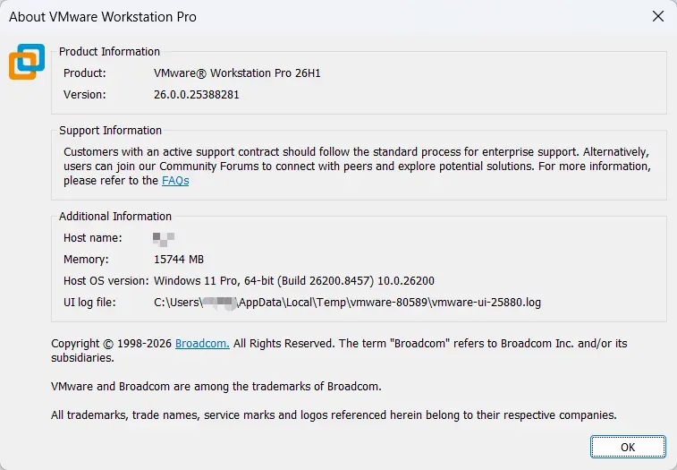
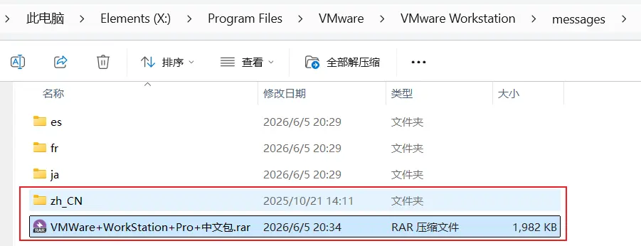
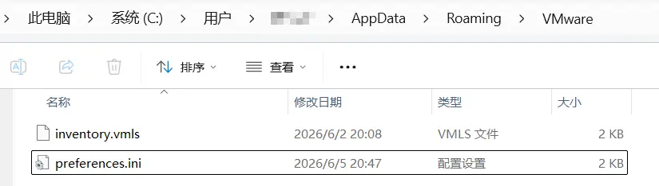
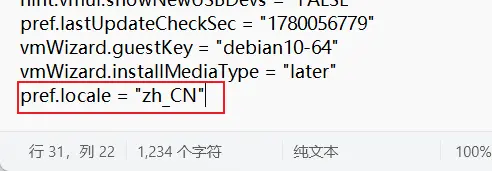
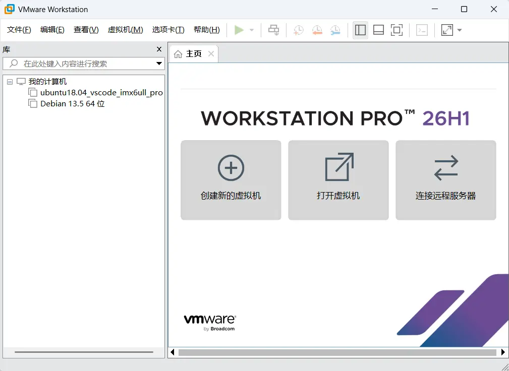
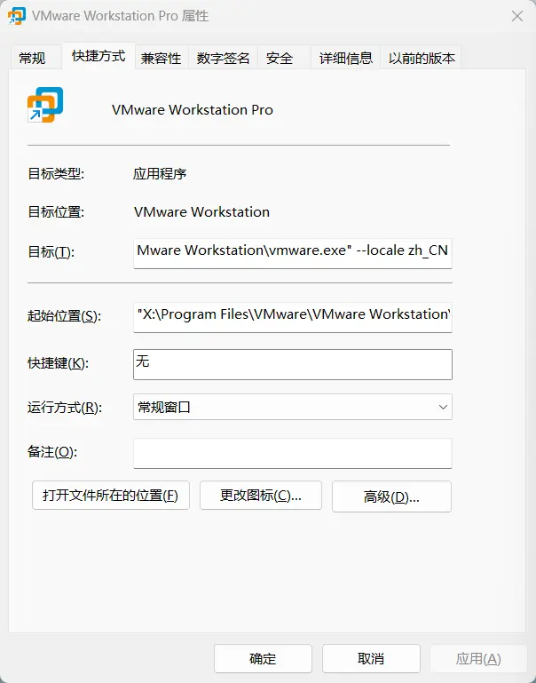

# 1 参考链接：
[(18 封私信) 虚拟机VMware Workstation Pro 25H2设置中文界面 - 知乎](https://zhuanlan.zhihu.com/p/1983613035533853677)

# 2 更新升级

我原本有 16.1.1 版本，安装过虚拟机，不需要卸载直接下载更新即可

博通官网下载：[ProductFiles - Support Portal - Broadcom support portal](https://support.broadcom.com/group/ecx/productfiles?subFamily=VMware%20Workstation%20Pro&displayGroup=VMware%20Workstation%20Pro%2026H1%20for%20Windows&release=26H1&os=&servicePk=543221&language=EN&freeDownloads=true)
要填不少个人信息

**注意：**
> 我使用QQ邮箱注册下载的时候提示 `Account verification is Pending. Please try after some time.` 换用学校邮箱可以下载
> 也看到有帖子建议 更新 personal profile，我没试过> 

# 3 安装环境：

安装过程省略，勾选path，更改路径即可

- Windows 11
- VMware Workstation Pro 26H1



# 4 切换中文

## 4.1 中文语言包复制

下载地址：
通过网盘分享的文件：VMWare WorkStation Pro 中文包.rar
链接: https://pan.baidu.com/s/1spiED2RAQwRp_VtzIDpzhg?pwd=4bi3 提取码: 4bi3 
--来自百度网盘超级会员v4的分享



## 4.2 编辑对应的配置文件




## 4.3 重新运行vmware虚拟机




# 5 在启动的时候直接指定语言

```bash
"X:\Program Files\VMware\VMware Workstation\vmware.exe" --locale zh_CN
```

