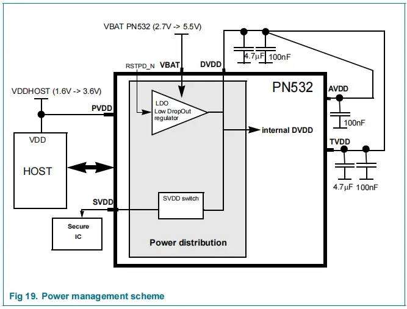

# 1 产品特点

- 支持UART, SPI, I2C三种模式
- RFID读写器支持：
- 读取距离可达5cm
- 板载电平转换器， I2C和UART使用5V TTL， SPI使用3.3V TTL
- 兼容 Arduino 开发板

# 2 开关选择

三种模式可以通过开关切换

|      | SET0 | SET1 |
| :--: | :--: | :--: |
| UART |  L   |  L   |
| SPI  |  L   |  H   |
| I2C  |  H   |  L   |
# 3 引脚说明

|     丝印     |        说明         | 备注                |
| :--------: | :---------------: | ----------------- |
|    SCK     |      SPI串行时钟      |                   |
|    MISO    |    SPI主机输入从机输出    |                   |
|    MOSI    |    SPI主机输出从机输入    |                   |
|     SS     |       SS片选        |                   |
|    IRQ     |        中断         |                   |
|    RSTO    |     复位，低电平有效      |                   |
|  SCL/TXD   |    I2C时钟/串口的TX    |                   |
|  SDA/RXD   |    I2C数据/串口的RX    |                   |
|   AUX1/2   | 模拟输出1/2，模拟和数字测试信号 | 电流输出，需要下拉1k电阻然后采样 |
| DBGTXD/RXD | 通用IO，调试UART的发送/接收 |                   |
|   INT0/1   |  通用IO/中断 INT0/1   |                   |
|   SIGCLK   |    通用IO/安全IC时钟    |                   |
|   SIGOUT   |    非接触式通信接口输出     |                   |
|   SIGIN    |    非接触式通信接口输入     |                   |
|   RSTPON   | 复位和断电，低电平时内部电流源关闭 |                   |

# 4 STM32L496VET6的外设接口

正点原子潘多拉开发板，SPI，I2C，UART很多引脚已经被占用了，这里选取空闲的外设引脚

按照[[#2 开关选择]] 把开关拨到对应的模式，然后按照下面的接口对应连线，**只能选择一个**，

> 如果需要其他接口、复用到其他引脚或者软件模拟，可以参考《STM32L496xxDatasheet》

## 4.1 SPI2

这里是复用引脚功能，不是默认配置

| 引脚   | 信号        |
| ---- | --------- |
| PB13 | SPI2_SCK  |
| PB14 | SPI2_MISO |
| PB15 | SPI2_MOSI |
**完整接线：**

| STM32L496VET6 |    说明     | PN532引脚 |     说明      | PN532芯片引脚 | 说明             |
| :-----------: | :-------: | :-----: | :---------: | --------- | -------------- |
|     PB12      |   软件SS    |    4    | NSS/SCL/RX  | 27        | 拉低选中从机         |
|     PB13      | SPI2_SCK  |    1    |     SCK     | 30        | SPI时钟          |
|     PB14      | SPI2_MISO |    2    |    MISO     | 29        | 主机输入从机输出       |
|     PB15      | SPI2_MOSI |    3    |    MOSI     | 28        | 主机输出从机输入       |
|      PB8      |    RST    |    6    |   RSTPD_N   | 38        | 复位和关机，低电平关机    |
|      PB9      |    IRQ    |    5    |     IRQ     | 25        | pn532向主机发送中断请求 |
|      GND      |    GND    |    7    |     GND     |           |                |
|      5V       |   5V输出    |    8    | 板载LDO转为3.3V |           |                |
> 说明：这里`PN532引脚`指的是PN532模块的排针标号
>`PN532芯片引脚`是 HVQFN 40 封装的PN532芯片的引脚号

供电方式：

## 4.2 I2C2

| 引脚   | 信号       |
| ---- | -------- |
| PB10 | I2C2_SCL |
| PB11 | I2C2_SDA |
完整接线：
不使用H_REQ

| STM32L496VET6 |    说明    | PN532引脚 |       说明        | PN532芯片引脚 | 说明             |
| :-----------: | :------: | :-----: | :-------------: | --------- | -------------- |
|     PB10      | I2C2_SCL |    4    | NSS/**SCL**/RX  | 27        | 拉低选中从机         |
|     PB11      | I2C2_SDA |    3    | MOSI/**SDA**/TX | 28        | 主机输出从机输入       |
|      PB8      |   RST    |    6    |     RSTPD_N     | 38        | 复位和关机，低电平关机    |
|      PB9      |   IRQ    |    5    |       IRQ       | 25        | pn532向主机发送中断请求 |
|      GND      |   GND    |    7    |       GND       |           |                |
|      5V       |   5V输出   |    8    |   板载LDO转为3.3V   |           |                |
## 4.3 UART3

| 引脚   | 信号        |
| ---- | --------- |
| PB10 | USART3_TX |
| PB11 | USART3_RX |

**完整接线：**

| STM32L496VET6 |    说明     | PN532引脚 |       说明        | PN532芯片引脚 | 说明             |
| :-----------: | :-------: | :-----: | :-------------: | --------- | -------------- |
|     PB10      | USART3_TX |    4    | NSS/SCL/**RX**  | 27        | 拉低选中从机         |
|     PB11      | USART3_RX |    3    | MOSI/SDA/**TX** | 28        | 主机输出从机输入       |
|      PB8      |    RST    |    6    |     RSTPD_N     | 38        | 复位和关机，低电平关机    |
|      PB9      |    IRQ    |    5    |       IRQ       | 25        | pn532向主机发送中断请求 |
|      GND      |    GND    |    7    |       GND       |           |                |
|      5V       |   5V输出    |    8    |   板载LDO转为3.3V   |           |                |