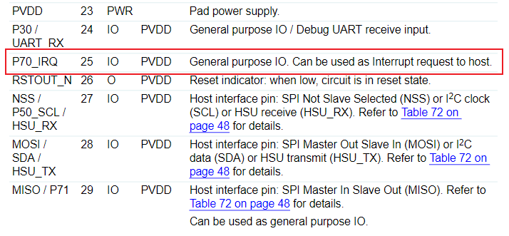
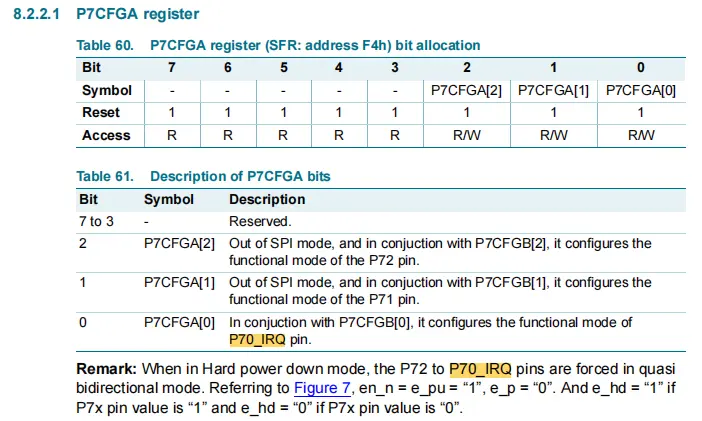
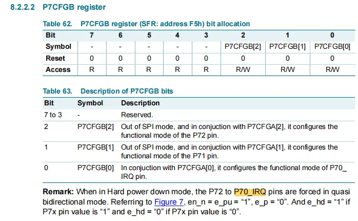

# 1 背景说明

我需要将 PN532 的 IRQ 引脚连接到 STM32L496VET6 的外部中断引脚上，用外部中断方式而非SPI轮询方式检测 PN532 模块，减少 CPU 的占用。
## 1.1 遇到问题：
### 1.1.1 PN532的IRQ中断引脚的作用和工作模式是什么？

NXP PN532手册官方下载链接：[PN532_C1.fm](https://www.nxp.com/docs/en/nxp/data-sheets/PN532_C1.pdf)
### 1.1.2 STM32 的中断引脚如何配置？

配置为外部中断模式，采用什么边沿触发？是否需要上拉？
# 2 IRQ引脚说明

7. Pinning information

8.2.2 节 P70_IRQ 是由 P7CFGA[0] 和 P7CFGB[0] 共同控制的，它们默认配置为10，也就是准双向模式，该模式下

[[../../硬件基础/硬件与协议/PN532引脚的准双向模式|PN532引脚的准双向模式]]

