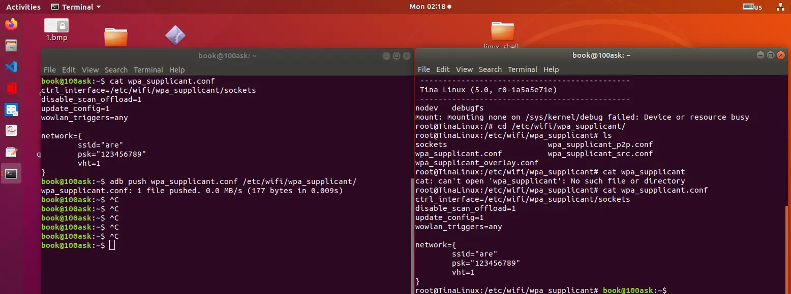

# 快速上手体验

## 1 开箱

一个智慧屏，一个USB线，一个电源适配器
## 2 体验步骤

### 2.1 连接电源

  注意必须使用配套的5V适配器

### 2.2 配置wifi

打开wifi配置，输入wifi名称和密码
已知卡在wifi连接界面
作者说明：

  > 目前已知WiFi部分存在一个概率出现的BUG，会导致卡住连不上网，可以拔掉电源重启后重试两次即可，待修复中。

尝试断电重试，没有解决。

**adb配网**

关于如何安装 adb 

